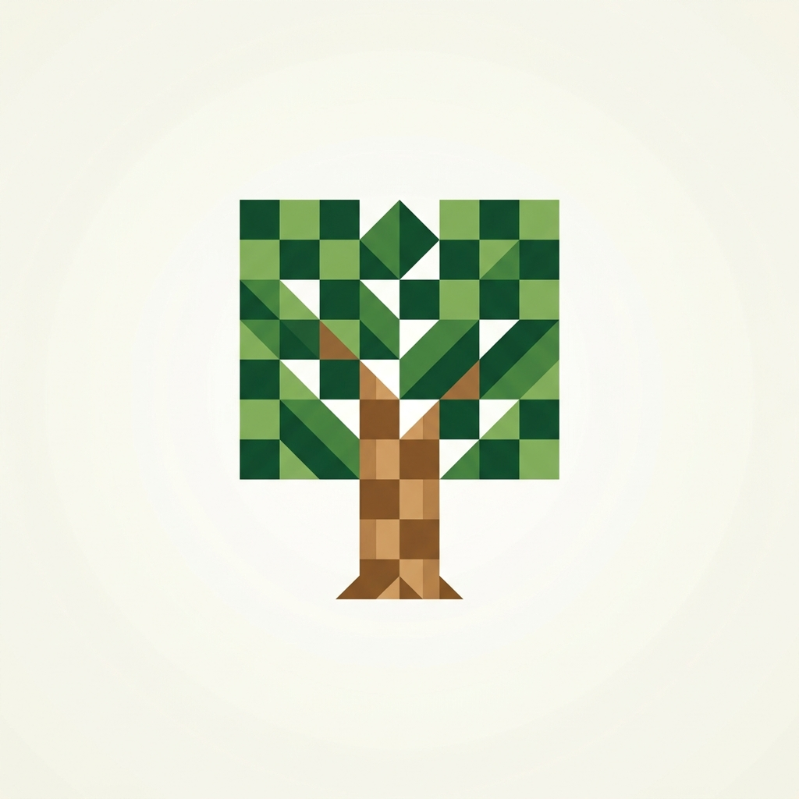

<p align="center">
  
</p>

# Chess Under The Tree

  

A browser-based 3D chess game set on grass under a tree. It provides dynamic player-versus-player modes with automated camera rotation, customizable timers, a robust move history panel, and post-game review features, along with 4 tiers of Stockfish-powered AI.

## Architecture

* `src/scene/` - React Three Fiber components for rendering the 3D board, pieces, camera rig, and environment.
* `src/ui/` - React DOM components for overlays, menus, pawn promotion, and HUD elements.
* `src/store/` - Zustand global state management connecting the 3D scene and 2D UI.
* `src/hooks/` - Custom React hooks for chess logic integration and camera movement.
* `src/utils/` - Helper functions for standardizing board logic and history replay.
* `public/` - Static assets including 3D models, textures, sounds, and the Stockfish web worker.

## Features

| Feature Module | Underlying Mechanism | System Benefit |
|---|---|---|
| Dynamic 3D Environment | React Three Fiber & Three.js | Creates an immersive, fully interactive chess board rendered in real-time. |
| Intelligent Camera System | Custom `useCamera` hook & Bezier interpolation | Automatically switches perspectives in PvP mode and allows top-down locking. |
| Robust Chess Logic | Chess.js & Zustand state synchronization | Guarantees legal moves, enforces turn order, and tracks captured pieces accurately. |
| AI Opponent | Stockfish Web Worker | Provides 4 distinct difficulty levels running completely off the main thread. |
| Post-Game Review | Historic FEN Replay & Stable Component Keys | Allows players to scrub forward and backward through the game timeline without unmounting piece components. |

## Tech Stack

| Layer | Technologies |
|---|---|
| Framework | React, Vite |
| 3D Rendering | React Three Fiber, Three.js |
| Logic & AI | Chess.js, Stockfish (Web Worker) |
| State Management | Zustand |
| Styling & UI | Tailwind CSS, Framer Motion |
| Audio | Howler.js |

## Prerequisites

| Software | Required Version | Installation Source |
|---|---|---|
| Node.js | >= 18.0.0 | [nodejs.org](https://nodejs.org) |
| npm | >= 9.0.0 | Included with Node.js |

## Installation

```bash
git clone https://github.com/Abdu1-Ahd/Chess-Under-the-trees.git
cd Chess-Under-the-trees
npm install
```

## Quickstart

Run the development server locally:

```bash
npm run dev
```
Navigate to `http://localhost:5173` in your browser.

Build for production:

```bash
npm run build
npm run preview
```

## Key Design Decisions

| Decision | Choice | Rationale |
|---|---|---|
| 3D Rendering | React Three Fiber | Allows declarative construction of the 3D scene fully integrated with React state. |
| State Management | Zustand | Avoids React Context re-render cascades; essential for 60fps 3D scene updates. |
| AI Integration | Web Worker | Prevents the intensive Stockfish engine calculations from freezing the UI thread. |
| Component Identification | Stable Identity Map Keys | Prevents React from needlessly unmounting 3D meshes during time-scrubbing in review mode. |

## Limitations

- The AI difficulty tiers rely on modifying Stockfish's skill level and search depth limits, which may not scale linearly in perceived human difficulty.
- Mobile browser support may suffer from high battery consumption due to WebGL rendering.
- Offline play against friends requires device passing (no native P2P network integration yet).

## Contributing

See [.github/CONTRIBUTING.md](.github/CONTRIBUTING.md).

## License

[MIT](LICENSE)
